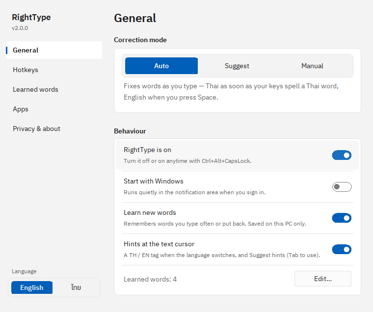
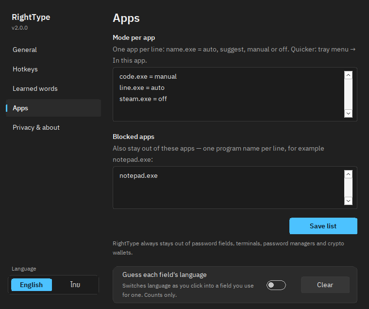
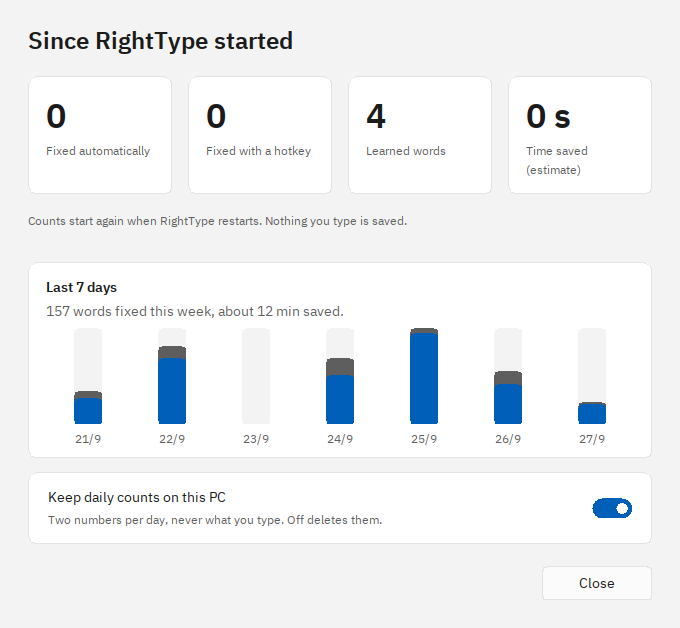
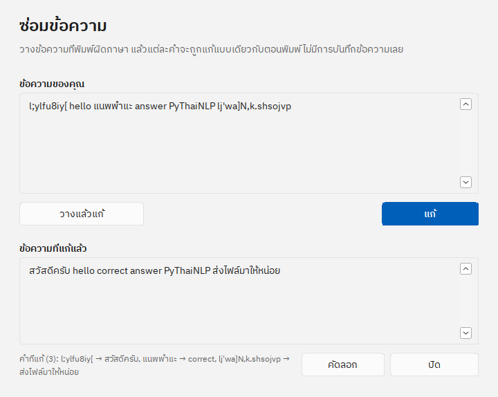
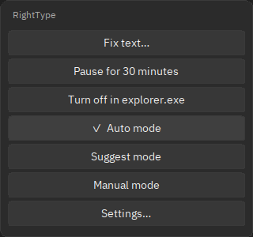
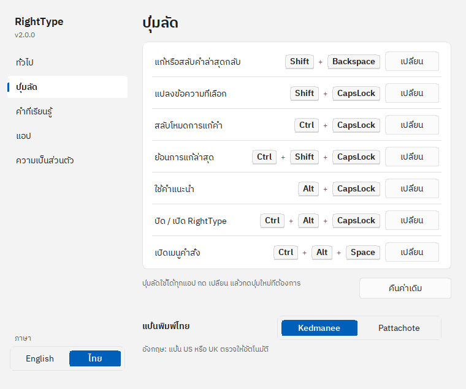

# RightType

A modern, safe **Rust** successor to [RightLang](https://www.rightlang.com/) — it fixes
text typed in the **wrong keyboard layout** (Thai Kedmanee typed while English QWERTY
is active, or vice-versa) **without retyping**.

> Type `correct` while Thai is active and you get `แนพพำแะ`. RightType turns it back
> into `correct` — automatically as you type, or on a hotkey.

## Why a rebuild?

RightLang is excellent but unmaintained, and its design causes real bugs:

| RightLang bug | RightType fix |
| --- | --- |
| Dies after the PC wakes from sleep (must kill & reopen) | Reinstalls the keyboard hook on power/session events, with one delayed retry |
| Manual switch sometimes emits `ggg…` garbage | Releases held modifiers + injects one atomic Unicode batch (never replays keys) |
| Dropped/reordered characters in Word | Injects raw Unicode codepoints — no layout switching, no race |

…plus a first-class **privacy/security layer** (see below) and a tiny footprint.

## How it works

| Settings | Apps: a mode per app | Statistics |
| --- | --- | --- |
|  |  |  |
| **Fix text** (Thai interface) | **Command palette** | **Hotkeys you can change** (Thai interface) |
|  |  |  |

RightType lives in the **system tray** (no window, no console). Click the tray icon
(left or right) for: **Enable**, **Pause** (10 minutes, 30 minutes or an hour —
it switches itself back on), **Manual/Auto/Suggest** mode, **In this app** (a mode
of its own, or off, for the app you were just typing in), **Learn new words**,
**Start with Windows**, **Fix text** (paste a paragraph typed in the wrong layout and
copy it back fixed), **Settings**, **Statistics**, **Hotkeys & help**, **Save a problem report**
(what RightType did lately, to attach to a bug report — words appear only as
letter counts, never as text), and **Quit**.
The tooltip shows the current mode, and the icon turns grey while RightType is off.

**Settings** has five pages — General (mode, on/off, start with Windows, learning),
Hotkeys, Learned words (see, add, remove, clear, import or export what RightType
has learned, or keep the list in a sync folder such as OneDrive), Apps (a mode per app, e.g. `code.exe = manual`, apps to stay out
of, and an opt-in **guess each field's language** that switches the keyboard as
you click into a field you always use for one language — only word counts are
kept) and Privacy & about (with a **Check for updates** button that opens the
Releases page in your browser — RightType itself never goes online). Changes take effect the moment you make
them. The interface is in **English or Thai** (it follows the Windows display
language; switch it at the bottom of the Settings sidebar), follows the Windows
**light/dark** app theme, and stays sharp at any display scaling.

**Manual mode (default)** — type freely; when you notice a wrong-layout word, fix it
with a hotkey:

| Hotkey | Action |
| --- | --- |
| `Shift`+`Backspace` | Convert the last word in place — or, right after Auto changed a word, flip it back. Press it again to flip the word before as well (up to 8 words). Each press says what it did; see [`docs/UNDO.md`](docs/UNDO.md) |
| `Shift`+`CapsLock` | Convert the current **selection**: read from the app through UI Automation (never through the clipboard, which Windows can keep in its history and sync to your phone), then typed back as Unicode. Apps that do not share their selection get a message; `selection_via_clipboard = true` in `config.toml` lets RightType copy it instead |
| `Ctrl`+`CapsLock` | Cycle **Manual** → **Auto** → **Suggest** (works in every app, including ones RightType otherwise stays out of; in an app with its own mode, cycles that app's mode) |
| `Tab` or `Alt`+`CapsLock` | Accept the current Suggest hint (Tab only right after it appears; otherwise Tab is Tab) |
| `Ctrl`+`Shift`+`CapsLock` | Undo the last correction (selection undo requires the same focused context) |
| `Ctrl`+`Alt`+`CapsLock` | Enable/disable RightType immediately |
| `Ctrl`+`Alt`+`Space` | Command palette: fix text, pause, off in this app, switch mode, settings |

Every hotkey can be changed in Settings → Hotkeys (click **Change**, press the new keys).

**Auto mode** — direction-aware, built for how each language is actually written:

- **EN → TH (instant)**: the moment your in-flight keystrokes form a known Thai
  word with high confidence, RightType fixes it **and switches to Thai** — your
  remaining keystrokes finish the word natively. No spaces required, none
  inserted: Thai doesn't work that way. It **holds** while the same keystrokes
  could still become an English word (`diffe` is on its way to `different`), so
  ordinary English typing is never converted mid-word — and for a few keystrokes
  after a conversion it keeps watching, putting the letters back by itself if the
  run turns out not to be Thai after all.
- **TH → EN (at whitespace)**: English *is* space-delimited, so the token
  commits when you hit space.
- **The whole word gets the last say.** A conversion made mid-word is not final:
  when you reach the space, RightType looks at the *entire* word — including the
  part typed after it switched to Thai — and if your keystrokes spell English it
  puts the whole word back and returns to English. (Before 1.1.0 only the part after
  the switch was judged, which could leave half-Thai, half-English words.)
- English is more than the dictionary: compounds of everyday words
  (`middleware`, `workflow`, `frontend`, `codebase`) and words you have taught it
  are treated as English everywhere.
- Ambiguous prefixes (a short valid word that begins a longer one) resolve in
  your favour as you keep typing; `Shift`+`Backspace` and Undo cover the rare
  miss. It deliberately does not destructively convert mid-word runs that aren't
  fully-known Thai — those stay available to Manual and Suggest.

**Suggest mode** uses the same rules as Auto but only shows the fix next to the
text cursor — as soon as the keys typed so far clearly spell it, not only at the
space. It changes text only when you take it (`Tab` right after it appears, or
`Alt`+`CapsLock`), and drops the hint when focus, layout, mode, or typing
context changes. A small `TH` / `EN` tag also flashes at the cursor whenever
RightType switches the language.

**Learning** (opt-in, "Learn new words") — an English word you type three times is
remembered, and so is any word you *flip back* after RightType changed it
(`Shift`+`Backspace` or Undo), immediately and in either language. Learned words
take effect at once for every decision.

Supported keyboards: Thai **Kedmanee** (default) or **Pattachote** (Settings →
Hotkeys → Thai keyboard), with English on the **US** or **UK** keyboard — English
of any country typed on either (Australia, New Zealand, Canada set to US, …),
found automatically. Dvorak and other layouts are left alone: RightType stays off
while one is active. Hotkeys can be changed in Settings → Hotkeys, and each app
can have its own mode (Settings → Apps).

Short, genuinely ambiguous words (e.g. `ok` vs Thai `นา`, which share keys) are left for
you to fix manually — no tool can resolve those without guessing.

The same limit applies to words RightType has never seen. A **typo or a name**
that is not in the English dictionary cannot be recognised as an unfinished
English word, so Auto mode may start converting one — but that decision stays
under review for the next few keystrokes and undoes itself as soon as the Thai
reading stops making sense. What survives is the narrow case where a mistyped
word's *entire* conversion keeps reading as valid Thai; `Shift`+`Backspace` flips
the whole word back — and, with learning on, remembers it so it does not happen
again.

## Privacy & security (built for sensitive typing)

A keyboard tool sees everything you type. RightType is designed so secrets never leak:

- **Sensitive-context guards** — it disables itself entirely in **password fields**
  (native `ES_PASSWORD`, and browser/Electron/UWP fields via UI Automation) and in a
  default blacklist of **wallets, password managers, and terminals**.
- **Secret-shaped bail-out** — even elsewhere, identifiable private keys and addresses
  are always ignored. Consecutive BIP39 words trigger a phrase-level stream guard.
  Password-like/long ASCII can be wrong-layout Thai;
  it is eligible only when the complete conversion is fully-known Thai, and it is never
  sent to the learning/persistence path.
- **Minimal in-memory footprint** — it holds only the word in progress and, for
  flipping back, the last few words (at most 8, dropped on a click, arrow key or
  window change); all are **zeroized** when dropped, and it runs **non-elevated**.
- **No telemetry, zero network code** — verifiable in `Cargo.lock`; there is no HTTP,
  update, or analytics crate anywhere in the dependency tree.
- **Nothing typed is written to disk** — the only files are app settings
  (`%APPDATA%\RightType\config.toml`) and, only if you turn them on: the learned
  words (`learned.txt`, "Learn new words"), two numbers per day for the 7-day
  chart (`stats.toml`) and per-field word counts for guessing a field's language
  (`contexts.toml`). All are **off by default**, and learning never runs in the
  sensitive contexts above.

The detailed data lifetimes, controls, and known residual risks are documented in
[`docs/THREAT_MODEL.md`](docs/THREAT_MODEL.md). In particular, ordinary English
words overlap the BIP39 list, so phrase-level protection is contextual/stream-based
rather than a blanket ban on every individual BIP39 word.

## For end users

### ติดตั้ง (ไม่ต้อง build เอง)

1. ไปที่หน้า **[Releases ล่าสุด](https://github.com/k-affan-th/RightType/releases/latest)**
   แล้วดาวน์โหลด `RightType-<เวอร์ชัน>-setup.exe`
2. ดับเบิลคลิกไฟล์ ถ้า Windows ขึ้น "Windows protected your PC" ให้กด
   **More info → Run anyway** (ไฟล์ยังไม่ได้ลงลายเซ็นดิจิทัล)
3. เลือกได้ว่าจะสร้าง shortcut และเปิดพร้อม Windows ไหม — ไม่ต้องใช้สิทธิ์ admin
4. RightType อยู่ที่มุมขวาล่างของจอ (ไอคอน **Aก**) คลิกเพื่อเปิดเมนูและหน้าตั้งค่า

ถอนการติดตั้ง: Settings → Apps → RightType

มี winget? `winget install k-affan-th.RightType` แล้วอัปเดตด้วย `winget upgrade k-affan-th.RightType`

### Install (no building needed)

**winget:** `winget install k-affan-th.RightType`, later `winget upgrade k-affan-th.RightType`
(once winget has accepted the release).

**Installer (recommended, per-user, no admin):** download
`RightType-2.0.1-setup.exe` from the
[latest release](https://github.com/k-affan-th/RightType/releases/latest) and run it.
It installs RightType, offers a desktop shortcut and start-at-login, and registers
a normal Windows uninstaller (Settings -> Apps -> RightType).

**Portable zip:** extract `RightType-2.0.1-x64.zip` and run `righttype.exe` where it
sits — or install it per-user from the extracted folder:

```powershell
powershell -ExecutionPolicy Bypass -File install.ps1 -Autostart
```

- Installs to `%LOCALAPPDATA%\RightType`, adds a **Start Menu shortcut**, and
  (with `-Autostart`) launches at login.
- Uninstall anytime: `powershell -ExecutionPolicy Bypass -File uninstall.ps1`
  (add `-KeepSettings` to preserve your config/learned words).
- Verify what you downloaded against `SHA256.txt` before running it:

```powershell
Get-FileHash -Algorithm SHA256 .\RightType-2.0.1-setup.exe
```
- Unsigned builds show a SmartScreen prompt — "More info → Run anyway".
  Code signing is planned for a later release.

## For developers

Requires the Rust **MSVC** toolchain and the Visual Studio C++ Build Tools (Desktop C++).

```sh
# Pure-logic core (no OS calls) — runs anywhere:
cargo test

# Full Windows app:
cargo run --features winos
cargo build --release --features winos

# Installer + portable zip + SHA256.txt into dist\ (version from Cargo.toml):
pwsh -File packaging\build_release.ps1
```

Changes per version are in [`CHANGELOG.md`](CHANGELOG.md).

**Releasing** needs no Windows machine: bump `version` in `Cargo.toml`, add its
`CHANGELOG.md` section, merge to `main`, then run **Actions → Release → Run
workflow** (or push a tag `v<version>`). The workflow tests, builds the installer,
zip and `SHA256.txt` on Windows and publishes them as a GitHub Release with
install instructions. How accurately and how
fast RightType handles a real mixed Thai/English text — and how often it touches
text that was typed correctly — is measured in
[`docs/TYPING_BENCHMARK.md`](docs/TYPING_BENCHMARK.md)
(`cargo run --release --example typing_benchmark`,
`cargo run --release --example false_positive_audit`).

The windows are drawn by `src/ui.rs` (real Win32 controls with custom painting, so
keyboard navigation and screen readers keep working). A debug build opens one
directly for a quick look: `RIGHTTYPE_SHOW=settings` (or `settings-hotkeys`, `settings-learned`,
`settings-blocked`, `settings-about`, `welcome`, `help`, `stats`). The interface
typeface is IBM Plex Sans Thai, embedded from `assets/fonts` under the SIL Open
Font License (`assets/fonts/OFL.txt`).

The crate is split into an OS-free **core** (`layout`, `secret`, `dict`, `detect`,
`segment`, `buffer` — exhaustively unit-tested) and a Windows **integration layer**
behind the `winos` feature (`hook`, `inject`, `manual`, `safety`, `focus`, `session`,
`tray`, `toast`, `config`, `startup`, `learn`). Keeping the core OS-free makes it
testable anywhere and a future macOS backend additive. See the long-term
[`docs/PLAN.md`](docs/PLAN.md) and the current
[`docs/DYNAMIC_PLAN.md`](docs/DYNAMIC_PLAN.md) for active decisions, evidence, and
the next implementation step. What comes next is planned there as
[RightType 2.0](docs/DYNAMIC_PLAN.md#s8--righttype-20); every feature idea — in 2.0
or not — is collected in [`docs/IDEAS.md`](docs/IDEAS.md).

## License

Dual-licensed under either of [MIT](LICENSE-MIT) or [Apache-2.0](LICENSE-APACHE) at
your option.
